# 🏭 Datamatrix Converter Web App 🔧

<p align="center">
  
</p>

---

<h3 align="center">
  <a href="https://mghazali27.github.io/packof5/">🚀 LIVE DEMO 🚀</a>
</h3>

---

This web application converts industrial datamatrix codes based on a predefined logic. It uses the device's camera to scan a datamatrix, processes the data, and generates a new datamatrix with the converted data.

This project is a **Progressive Web App (PWA)**, which means you can "install" it on your phone or desktop for easy access and an app-like experience.

## ⚙️ App Workflow

```mermaid
graph TD
    subgraph "First Time Use"
        A[📱 Open App URL] --> B{PWA Features Load}
        B --> C[🌐 App Caches for Offline Use]
        B --> D[⭐ Browser offers Install App / Add to Home Screen]
    end

    subgraph "Core Logic"
        E[📷 Scan Datamatrix] --> F{Decode Data}
        F --> G[⚙️ Process Data]
        G --> H{Find Ref in database.json}
        H --> I[Extract Quantity \- pos 20 to 23]
        I --> J[Calculate New Quantity]
        J --> K[Reconstruct String]
        K --> L[📊 Display Results]
        L --> M[🔳 Generate New Datamatrix]
        M --> N[🔄 Click Scan Next to restart]
        N --> E
    end

    D --> O[🏠 App installed on Home Screen]
    O --> E
    A --> E
```



## 🛠️ Technologies Used

*   **HTML, CSS, JavaScript:** The core technologies for building the web application.
*   **Progressive Web App (PWA):** Using a Manifest and Service Worker for installation and offline capabilities.
*   **@zxing/library:** A JavaScript library for decoding barcodes from images and video streams.
*   **bwip-js:** A JavaScript library for generating barcodes.

## 📦 How to Use

1.  **Open the App:** Navigate to the application's URL in a modern web browser (like Chrome) on your phone or desktop.
2.  **Install the App (Recommended):** Look for a prompt or a button in your browser's menu to **"Install App"** or **"Add to Home Screen"**. This will create a shortcut for easy access.
3.  **Allow Camera Access:** The first time you use it, the app will ask for permission to use your camera.
4.  **Scan a Code:** Point the rear-facing camera at a datamatrix code.
5.  **Get Results:** The app will display the original and converted data, along with a new, scannable datamatrix.
6.  **Scan Again:** Click the "Scan Next" button to reset the app for the next scan.

## 🗃️ Project Structure

*   `index.html`: The main HTML file.
*   `style.css`: The stylesheet for the application.
*   `script.js`: The main JavaScript file containing the application logic.
*   `database.json`: A file containing the reference keys and their multipliers.
*   `manifest.json`: The Web App Manifest file that makes the app installable.
*   `sw.js`: The Service Worker that enables offline functionality.
*   `icon-192.png` / `icon-512.png`: The application icons.

## 📈 Managing the Database

You can easily add, edit, or remove reference data by modifying the `database.json` file. The file uses a simple key-value format:

```json
{
  "REFERENCE_KEY_1": MULTIPLIER_1,
  "REFERENCE_KEY_2": MULTIPLIER_2,
  "00C029CB01": 5
}
